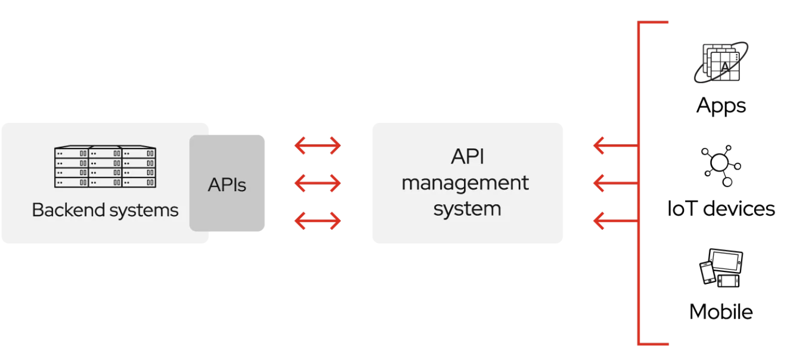
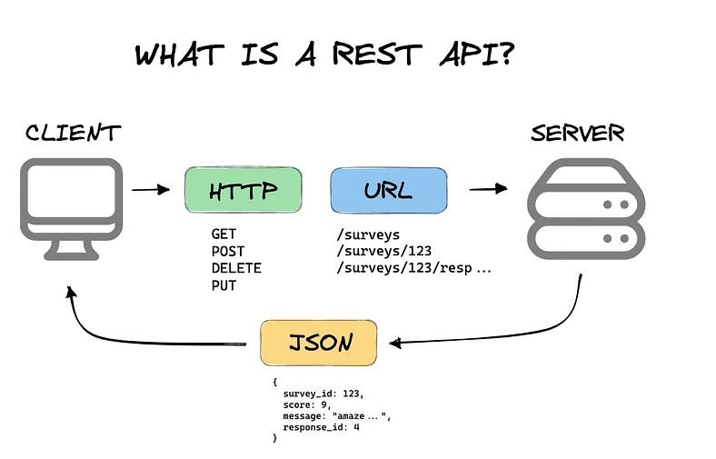

# REST API Fundamentals, Resources, URI Design and JSON Contracts

## Analogy
- Computers on the internet is like houses and buildings in a city. 
- Connection between buildings is crucial to share dependencies among the city. 
- The HTTP is the one of the types of pipes connecting houses/building through the city.
- API is the translator/mediator to talk between houses in this city. 
- REST API is the one of the popularly agreed language, or the etiquette we follow between computer to talk to each other and share resources. 
- Resources are the commodities of this city.
- URI Design is the format in which the resource is identified. The resource can be address by it name (URN) or its address (URL).
- JSON Contract is an mutually agreed agreement on what are they going to share between themselves. 

## What is API?

API (Application Programming Interface) is the mediator between two programming softwares.
This way, both software doesn't have to worry about how the sent data will be used by the other software. API takes care of that. All they have to do is comply to the API rules.



## What is REST API?

REST (Representational State Transfer) API is a common set of convention that allow two softwares to talk to each other over the internet.


Mostly you request for a resource and you get a JSON file.
There are 6 rules we need to follow to oblige to the REST API principles:

## Six constraints of REST API
### 1. Client-Server
REST API is built on the fact that there is a clear separation between client and server.
Client takes care of the user interface and user interaction, while server takes care of the database, logic, etc.
This separation helps the client to be able to adapt to different platforms while server is able to scale individually. This helps us to scale them effectively.

### 2. Stateless-ness
Since we have separated the network into client-server dynamics, we expect the communication not to have contextual conversation. So each request contains all the information needed to convey for implementing the request.
This improves visibility, reliability and scalability.
Session state is then entirely on the client.
The disadvantage of this is that, since the server doesn't have the state of the client, we have network performance since the performance depends on consistent information shared in the request, adding overhead. Also this reduces the server's control over repeated application behaviour.

### 3. Cacheable
In order to improve network efficiency, cache is used.
It stores the frequently used information inside the client so that client can reuse that instead of asking to the server again and again.
The advantage is network efficiency.
The disadvantage is the possibility of the actual information in the server not matching with the cache information over time. The client may hold outdated information from the server's latest information. "Cache-control can be used here to prevent this."

### 4. Uniform Interface
Before REST APIs, the web used their own API for their own software and backends. This led to developers having to remember obscure function to implements functions. 
Also each servers had their own way of doing things. Each requests were specific to each of the servers. 
To unify this, REST API wants clients and servers to interact through a consistent, predictable interface.
Advantage: Ease of use for developers.
Disadvantage: Efficiency. 
### 5. Layered System
Each layer only has to be visible to the layer next to it. The client doesn't have to communicate directly with the final server. Each layer in the architecture has its own responsibility.
Advantage: This makes it easy to scale. Adds the ability to add intermediary layers like firewall, load balancer, etc.
Disadvantages: Adds overhead and latency to the overall system.
Caching can alleviate some of the performance issues in this.

### 6. Code-On-Demand (Optional) 
One of the optional constraints of REST API is to be able to recieve an executable code for a HTTP request.

## What is resource?
Resource is any object on the internet, like audio, video, folder, etc, which is accessed and manipulated by the client. 
To put it simply, if HTTP request is a sentence, then resource is the **noun** while HTTP method is the **verb** of the sentence.

## URI Design
URI (Uniform Resource Identifier) is an string of words which represents the location of a resource in the network/internet.

URI is split into two: URL(Uniform Resource Link) and URN(Uniform Resource Name).
We are mostly interested in URL since HTTP is about accessing resources through its location.

The structure of the URL is:
```text
protocol://domain_name:port/path?query_key=query_value#fragment
```
Protocol is the protocol used by the interface to retrieve information from the internet.

Domain name is the human readable identifier for a server on the internet.

Port is the virtual endpoint of a server through which the communication happens. 

Path is the path of the resource inside the server.

Query parameters are pairs of keys and value passed on to the URL to add additional information about the resource request.

Fragment of the URL is to jump to a specific portion of the resource.

## JSON Contracts
JSON Contract is a formal agreement between client and server on which data the server can provide and which data the client is ready to recieve.
Example: 
```json
{
  "endpoint": "/api/users/:id",
  "method": "GET",
  "description": "Get a user by their ID",
  "request": {
    "params": {
      "id": {
        "type": "integer",
        "required": true,
        "description": "The user's unique ID"
      }
    },
    "headers": {
      "Authorization": {
        "type": "string",
        "required": true,
        "description": "Bearer token for authentication"
      }
    }
  },
  "response": {
    "200": {
      "body": {
        "id": { "type": "integer" },
        "name": { "type": "string" },
        "email": { "type": "string" },
        "createdAt": { "type": "string", "format": "date-time" }
      }
    },
    "404": {
      "body": {
        "error": { "type": "string" },
        "message": { "type": "string" }
      }
    }
  }
}
```

